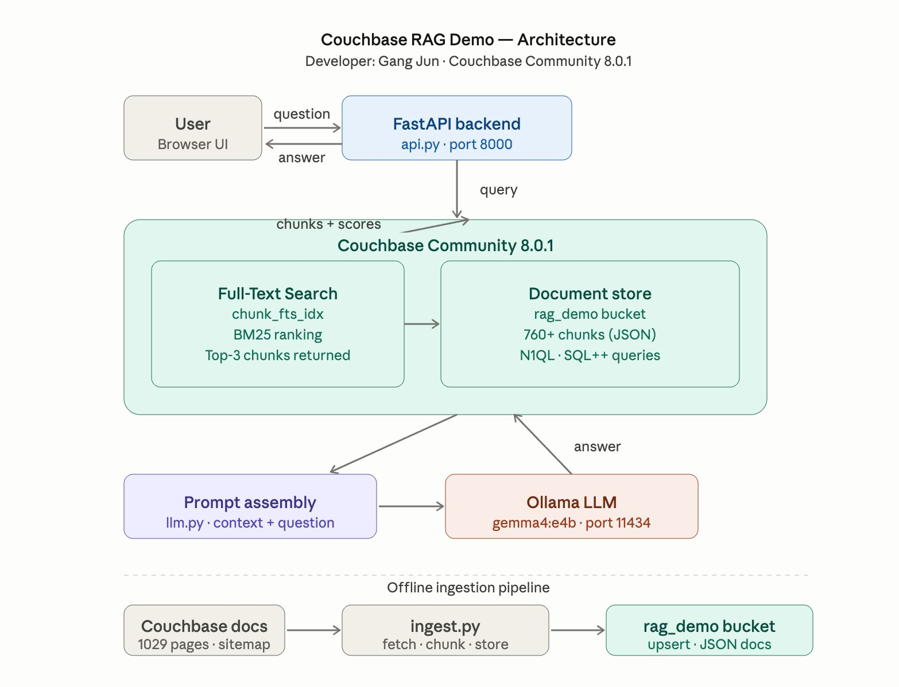
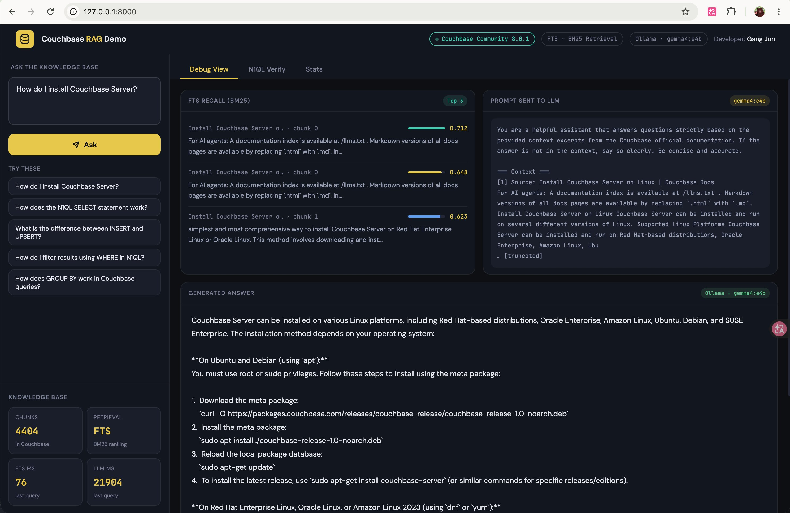
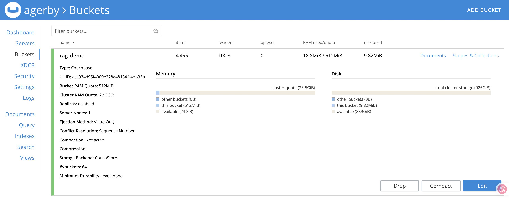

# Couchbase RAG Demo - Developed By: Gang Jun

A fully local Retrieval-Augmented Generation (RAG) application powered by **Couchbase Community Edition 8.0.1**, **Ollama (gemma4:e4b)**, and **FastAPI** — no cloud services, no API keys, no proprietary infrastructure.


---

## Overview

This demo shows how Couchbase can serve as the backbone of an AI-powered knowledge base application. The knowledge base is built from the official Couchbase Server documentation (1,029 pages), ingested via sitemap, chunked, and stored as JSON documents. At query time, Couchbase Full-Text Search (FTS) retrieves the most relevant document chunks using BM25 ranking, which are then passed as context to a local LLM to generate a grounded answer.

The entire pipeline runs on a single laptop — no internet connection is required at inference time.

---

## Architecture



The application is organized into two pipelines:

**Offline ingestion (run once):**
1. Fetch all pages from the Couchbase Server documentation sitemap
2. Parse and clean HTML, split into 400-word overlapping chunks
3. Store each chunk as a JSON document in the `rag_demo` Couchbase bucket

**Online query (real-time):**
1. User submits a question via the browser UI
2. FastAPI backend submits the question to the Couchbase FTS index
3. BM25 ranking returns the Top-3 most relevant chunks with relevance scores
4. Chunks are assembled into a prompt and sent to the local Ollama LLM
5. The generated answer is returned to the frontend along with full debug information

---

## Couchbase Community Edition — Role in This Demo

Couchbase is not just a storage layer in this demo — it is the core retrieval engine. The following Couchbase capabilities are actively used:

### 1. JSON Document Store
All knowledge base content is stored as structured JSON documents in the `rag_demo` bucket. Each document contains the chunk text, source URL, source title, chunk index, and ingestion timestamp. The flexible JSON model means no schema migration is needed when the document structure changes.

### 2. Full-Text Search (FTS) with BM25 Ranking
The `chunk_fts_idx` FTS index powers the retrieval step. When a user asks a question, the query string is submitted directly to the FTS service, which applies BM25 term-frequency ranking to find the most relevant chunks across 4,400+ documents. BM25 is the same algorithm used by Elasticsearch and Apache Solr — running natively inside Couchbase with no external search engine required.

### 3. N1QL / SQL++ Queries
The demo includes a live N1QL verification panel that lets viewers confirm the data is genuinely stored in Couchbase. A `CONTAINS()` query is executed in real time against the bucket, returning matching document previews with source titles and chunk indices. This makes the backend fully transparent during a presentation.

### 4. Key-Value Access
After FTS returns matching document IDs and scores, the full document content is fetched via direct key-value lookup — sub-millisecond reads that do not require a query plan or index scan.

### 5. Couchbase Web Console
The Couchbase Web Console at `http://127.0.0.1:8091` provides live visibility into the running system during a demo: the Buckets page shows 4,456 documents with memory and disk usage; the Search page shows the active FTS index with document count; the Query Workbench allows live N1QL execution.

---

## Demo UI



The frontend is a single-page HTML application served by FastAPI. It provides three views:

**Debug View** — shows the full RAG pipeline for each query: FTS recall results with BM25 relevance scores, the raw prompt sent to the LLM, and the generated answer with timing breakdowns (FTS latency vs. LLM latency).

**N1QL Verify** — auto-generates and executes a N1QL query based on the current question's keywords, showing raw document previews from Couchbase. This panel is designed to prove to a live audience that the retrieval is backed by a real database, not an in-memory cache.

**Stats** — displays knowledge base metadata: total chunk count, bucket name, FTS index name, retrieval method, and LLM model.

---

## Couchbase Console



The `rag_demo` bucket stores **4,456 documents** with a 512 MiB RAM quota, using **9.82 MiB** of disk. The bucket uses the CouchStore storage backend with value-only ejection, meaning hot documents remain fully resident in memory (100% resident ratio shown above).

During a live presentation, the Console can be used to:
- Browse individual chunk documents (Documents view)
- Verify the FTS index is active and processing documents (Search view)
- Execute live N1QL queries in the Query Workbench to demonstrate data retrieval
- Show the Query Monitor for completed query history

---

## Tech Stack

| Component | Technology |
|-----------|-----------|
| Database | Couchbase Community Edition 8.0.1 |
| Retrieval | Couchbase Full-Text Search (BM25) |
| LLM | Ollama · gemma4:e4b |
| Backend | FastAPI · Python 3.11 |
| Frontend | Vanilla HTML/CSS/JS |
| Knowledge base | Couchbase Server official docs (1,029 pages) |

---

## Prerequisites

- Couchbase Community Edition 8.0.1 running on `localhost:8091`
- Ollama running on `localhost:11434` with `gemma4:e4b` pulled
- Python 3.11 (via conda or venv)

---

## Quick Start

```bash
# 1. Clone the repo
git clone https://github.com/your-username/couchbase-rag-demo.git
cd couchbase-rag-demo

# 2. Create and activate Python 3.11 environment
conda create -n couchbase-demo python=3.11
conda activate couchbase-demo

# 3. Install dependencies
pip install -r requirements.txt

# 4. Set your Couchbase password in config.py
# COUCHBASE_PASSWORD = "your_password"

# 5. Pull Ollama model
ollama pull gemma4:e4b

# 6. Initialize Couchbase (bucket, collection, FTS index)
python setup_couchbase.py

# 7. Ingest documentation (runs once, supports resume)
python ingest.py

# 8. Start the server
uvicorn api:app --host 127.0.0.1 --port 8000

# 9. Open browser
open http://127.0.0.1:8000
```

---

## Project Structure

```
couchbase-rag-demo/
├── config.py              # All configuration (host, models, bucket, sections)
├── setup_couchbase.py     # One-time Couchbase setup (bucket + indexes)
├── ingest.py              # Sitemap fetch → chunk → store pipeline
├── ollama_client.py       # Ollama LLM call wrapper
├── search.py              # FTS retrieval (REST API) + N1QL verify
├── llm.py                 # Prompt assembly + answer generation
├── api.py                 # FastAPI application
├── requirements.txt       # Python dependencies
├── static/
│   └── index.html         # Frontend single-page app
├── docs/
│   └── screenshots/       # Architecture and UI screenshots
└── README.md
```

---

## Notes

- Vector Search is an Enterprise Edition feature. This demo uses FTS (BM25) which is fully supported in Community Edition.
- The ingestion pipeline supports resume — re-running `ingest.py` skips already-stored documents.
- LLM response time (~20s) reflects local CPU inference on `gemma4:e4b`. GPU acceleration via Ollama will significantly reduce this.

